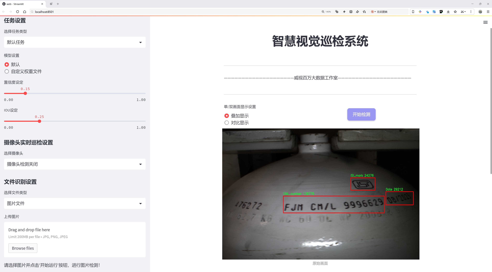
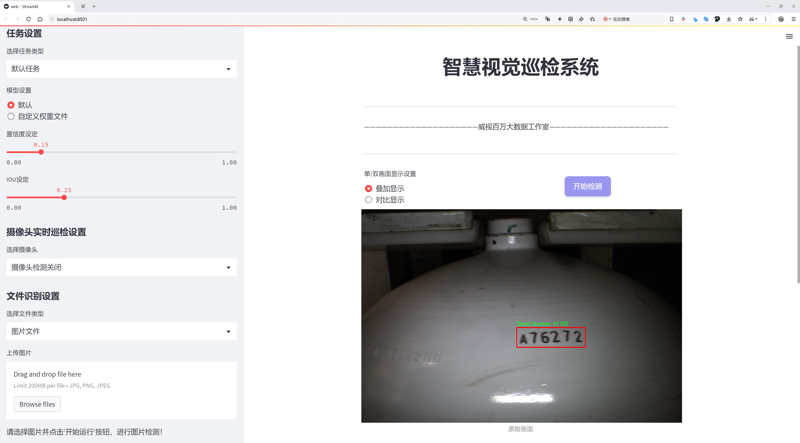
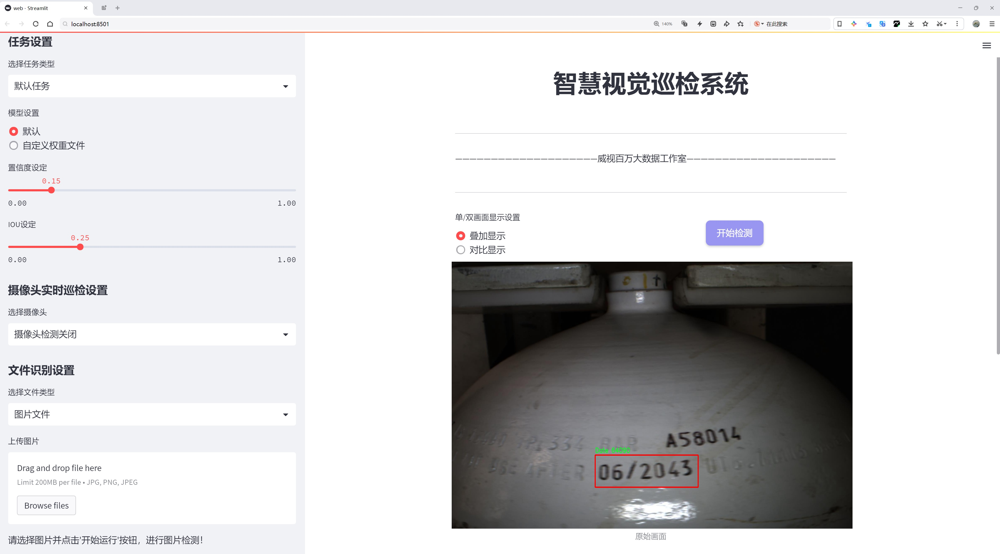
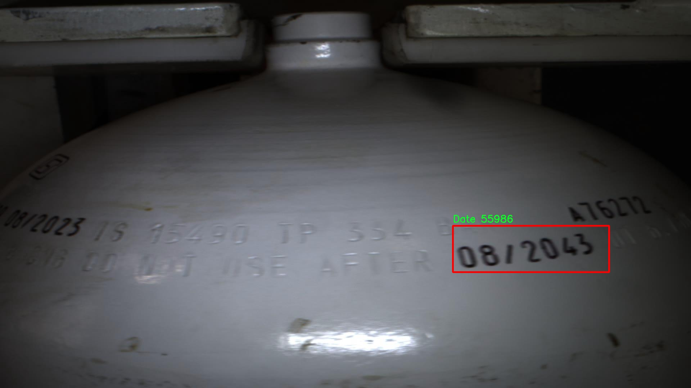
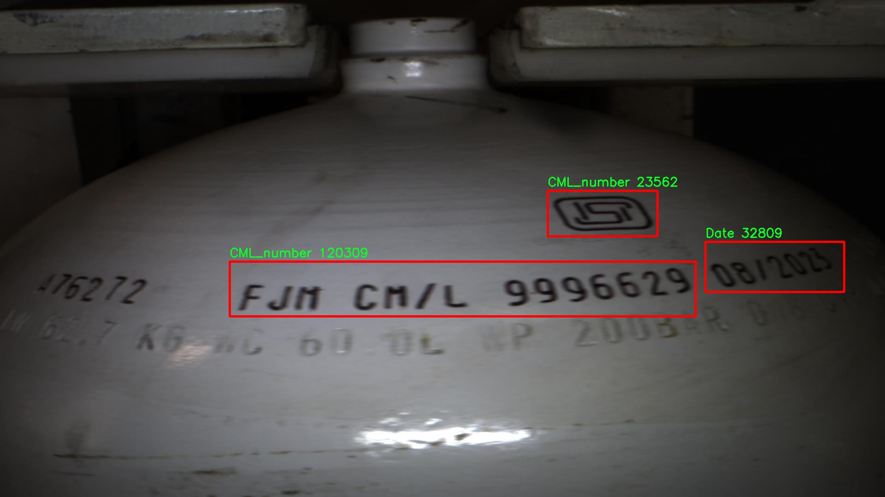
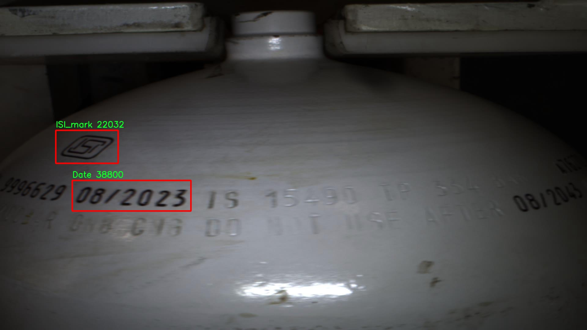
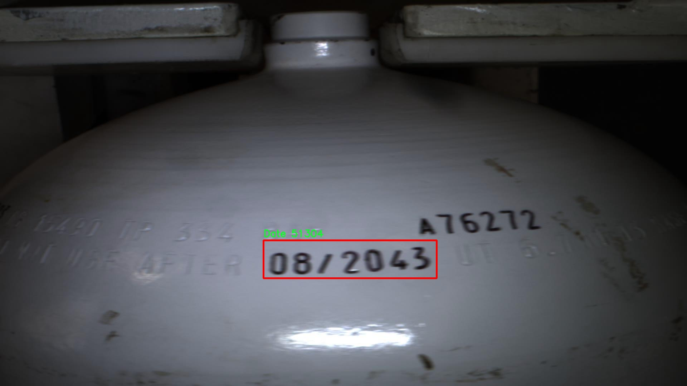
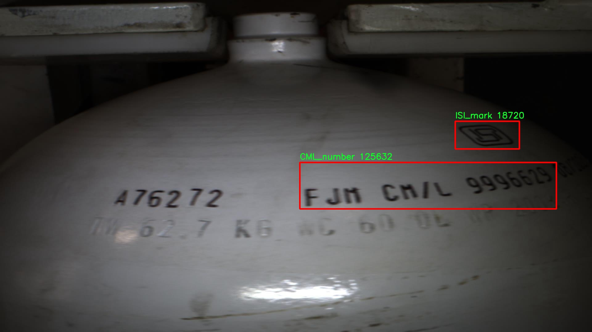

# 气罐刻印信息识别检测系统源码分享
 # [一条龙教学YOLOV8标注好的数据集一键训练_70+全套改进创新点发刊_Web前端展示]

### 1.研究背景与意义

项目参考[AAAI Association for the Advancement of Artificial Intelligence](https://gitee.com/qunshansj/projects)

项目来源[AACV Association for the Advancement of Computer Vision](https://gitee.com/qunmasj/projects)

研究背景与意义

随着工业化进程的加快，气罐作为重要的能源储存设备，其安全性和可追溯性日益受到重视。气罐上刻印的信息不仅承载着产品的基本信息，还涉及到安全监管、维护保养及产品召回等多个方面。因此，如何高效、准确地识别气罐上的刻印信息，成为了当前工业界和学术界亟待解决的技术难题。传统的人工识别方法不仅耗时耗力，而且容易受到人为因素的影响，导致识别结果的不准确性。为此，基于深度学习的图像识别技术应运而生，尤其是目标检测算法的快速发展，为气罐刻印信息的自动识别提供了新的解决方案。

YOLO（You Only Look Once）系列算法以其高效的实时检测能力和良好的准确性，逐渐成为目标检测领域的主流方法。YOLOv8作为该系列的最新版本，进一步提升了检测精度和速度，尤其在复杂背景下的目标识别能力上表现突出。然而，针对气罐刻印信息的识别，现有的YOLOv8模型仍存在一定的局限性，例如对不同刻印字体、大小和环境光照变化的适应性不足。因此，改进YOLOv8模型，以更好地适应气罐刻印信息的识别需求，具有重要的理论和实际意义。

本研究基于“20thNov_GasTank_Engraving”数据集，该数据集包含2079张气罐刻印信息的图像，涵盖了四个类别：CML_number、Date、ISI_mark和Serial_Number。这些类别的多样性为模型的训练提供了丰富的样本，有助于提高模型的泛化能力和识别准确率。通过对数据集的深入分析，我们可以发现，不同类别的刻印信息在图像中的表现形式各异，这为模型的改进提供了明确的方向。针对这些特征，我们将通过数据增强、特征提取优化和模型结构调整等手段，提升YOLOv8在气罐刻印信息识别中的表现。

此外，气罐刻印信息的自动识别系统不仅可以提高工作效率，降低人工成本，还能在一定程度上减少人为错误，提升气罐管理的安全性和可靠性。随着物联网和智能制造的不断发展，气罐刻印信息的自动化识别将为实现智能化管理提供有力支持，推动相关行业的数字化转型。

综上所述，基于改进YOLOv8的气罐刻印信息识别系统的研究，不仅具有重要的学术价值，也为实际应用提供了切实可行的解决方案。通过该研究，我们期望能够在目标检测领域取得新的突破，为气罐安全管理提供更为高效、智能的技术手段，从而推动相关行业的可持续发展。

### 2.图片演示







##### 注意：由于此博客编辑较早，上面“2.图片演示”和“3.视频演示”展示的系统图片或者视频可能为老版本，新版本在老版本的基础上升级如下：（实际效果以升级的新版本为准）

  （1）适配了YOLOV8的“目标检测”模型和“实例分割”模型，通过加载相应的权重（.pt）文件即可自适应加载模型。

  （2）支持“图片识别”、“视频识别”、“摄像头实时识别”三种识别模式。

  （3）支持“图片识别”、“视频识别”、“摄像头实时识别”三种识别结果保存导出，解决手动导出（容易卡顿出现爆内存）存在的问题，识别完自动保存结果并导出到tempDir中。

  （4）支持Web前端系统中的标题、背景图等自定义修改，后面提供修改教程。

  另外本项目提供训练的数据集和训练教程,暂不提供权重文件（best.pt）,需要您按照教程进行训练后实现图片演示和Web前端界面演示的效果。

### 3.视频演示

[3.1 视频演示](https://www.bilibili.com/video/BV12gpJe7ELZ/)

### 4.数据集信息展示

##### 4.1 本项目数据集详细数据（类别数＆类别名）

nc: 4
names: ['CML_number', 'Date', 'ISI_mark', 'Serial_Number']


##### 4.2 本项目数据集信息介绍

数据集信息展示

在本研究中，我们使用了名为“20thNov_GasTank_Engraving”的数据集，以训练和改进YOLOv8模型，旨在实现对气罐刻印信息的高效识别。该数据集专注于气罐表面刻印的多种信息，涵盖了四个主要类别，分别为CML_number、Date、ISI_mark和Serial_Number。这些类别的选择不仅反映了气罐管理和追踪的重要性，也为相关行业提供了标准化的数据支持。

首先，CML_number（化学物质清单编号）是气罐标识的重要组成部分，它用于识别气罐内所储存的化学物质。这一信息对于安全管理和应急响应至关重要，确保在发生泄漏或其他紧急情况时，相关人员能够迅速获取气罐内物质的详细信息，从而采取适当的应对措施。数据集中包含的CML_number样本，涵盖了多种不同的格式和字体，确保模型能够适应各种实际应用场景。

其次，Date（日期）信息在气罐管理中同样扮演着重要角色。气罐的生产日期、检验日期和有效期等信息，都是确保气罐安全使用的关键因素。通过对日期信息的准确识别，相关人员可以及时了解气罐的使用状态，避免因过期或未检验的气罐而导致的安全隐患。数据集中包含的日期样本，涵盖了不同的日期格式和排列方式，以增强模型的鲁棒性。

第三，ISI_mark（印度标准局标记）是气罐合规性的重要标识，表明该气罐符合国家安全标准。识别这一信息不仅有助于确保气罐的合法性，还能为消费者提供安全保障。数据集中提供了多种不同样式和尺寸的ISI_mark样本，以帮助模型学习如何在不同背景和光照条件下进行准确识别。

最后，Serial_Number（序列号）是气罐的唯一标识符，用于追踪气罐的生产和流通信息。通过对序列号的准确识别，企业能够有效管理气罐的库存和使用情况，确保产品的可追溯性。这一类别的数据样本同样多样化，涵盖了不同的字体、颜色和背景，以提高模型在实际应用中的适应能力。

总的来说，“20thNov_GasTank_Engraving”数据集的设计充分考虑了气罐刻印信息的多样性和复杂性，涵盖了关键的四个类别，为改进YOLOv8模型提供了丰富的训练素材。通过对这些刻印信息的高效识别，研究旨在提升气罐管理的智能化水平，进而提高安全性和合规性。该数据集不仅为学术研究提供了基础，也为实际应用中的气罐监控和管理提供了重要的数据支持。











### 5.全套项目环境部署视频教程（零基础手把手教学）

[5.1 环境部署教程链接（零基础手把手教学）](https://www.ixigua.com/7404473917358506534?logTag=c807d0cbc21c0ef59de5)


[5.2 安装Python虚拟环境创建和依赖库安装视频教程链接（零基础手把手教学）](https://www.ixigua.com/7404474678003106304?logTag=1f1041108cd1f708b01a)

### 6.手把手YOLOV8训练视频教程（零基础小白有手就能学会）

[6.1 手把手YOLOV8训练视频教程（零基础小白有手就能学会）](https://www.ixigua.com/7404477157818401292?logTag=d31a2dfd1983c9668658)

### 7.70+种全套YOLOV8创新点代码加载调参视频教程（一键加载写好的改进模型的配置文件）

[7.1 70+种全套YOLOV8创新点代码加载调参视频教程（一键加载写好的改进模型的配置文件）](https://www.ixigua.com/7404478314661806627?logTag=29066f8288e3f4eea3a4)

### 8.70+种全套YOLOV8创新点原理讲解（非科班也可以轻松写刊发刊，V10版本正在科研待更新）

由于篇幅限制，每个创新点的具体原理讲解就不一一展开，具体见下列网址中的创新点对应子项目的技术原理博客网址【Blog】：


[8.1 70+种全套YOLOV8创新点原理讲解链接](https://gitee.com/qunmasj/good)

### 9.系统功能展示（检测对象为举例，实际内容以本项目数据集为准）

图9.1.系统支持检测结果表格显示

  图9.2.系统支持置信度和IOU阈值手动调节

  图9.3.系统支持自定义加载权重文件best.pt(需要你通过步骤5中训练获得)

  图9.4.系统支持摄像头实时识别

  图9.5.系统支持图片识别

  图9.6.系统支持视频识别

  图9.7.系统支持识别结果文件自动保存

  图9.8.系统支持Excel导出检测结果数据


### 10.原始YOLOV8算法原理

原始YOLOv8算法原理

YOLOv8算法作为YOLO系列的最新进展，继承并扩展了前几代YOLO模型的核心思想，尤其是在目标检测领域的应用。该算法的设计理念依然围绕着将目标检测任务转化为一个回归问题，旨在通过一个统一的神经网络模型同时预测目标的位置和类别。YOLOv8的网络结构由输入层、主干网络、特征融合层和解耦头组成，整体架构的设计在保持高效性的同时，力求提升检测精度和速度。

在主干网络部分，YOLOv8继续采用YOLOv5中的CSPDarknet结构，然而对C3模块进行了替换，采用了C2f模块。这一改动不仅实现了模型的轻量化，同时在保持高精度的前提下，增强了特征提取的能力。C2f模块的设计灵感来源于YOLOv7的ELAN思想，具有两个分支结构，其中一个分支直接将特征图传递到Concat层，而另一个分支则通过一系列Bottleneck网络进行处理。这样的设计使得网络能够在提取特征时，形成更丰富的梯度流，从而有效缓解深层模型中的梯度消失问题，提升了特征的重用率。

特征融合层采用了PAN-FPN结构，这一结构在YOLOv8中经过了优化，删除了YOLOv5中上采样阶段的1x1卷积，直接将高层特征进行上采样并与中层特征进行融合。这种自下而上的融合方式，确保了浅层特征的细节信息与高层特征的语义信息能够充分结合，进而提升了目标检测的准确性。通过这种方式，YOLOv8能够在不同尺度上进行特征的有效融合，使得网络在处理多尺度目标时表现更加优异。

YOLOv8的一个显著创新在于其采用了Anchor-Free的目标检测方法。传统的YOLO系列模型通常依赖于预定义的锚点框来预测目标的位置，这种方法在处理不同尺度和形状的目标时往往显得繁琐且不够灵活。而YOLOv8通过引入Anchor-Free的思想，直接预测目标的位置和大小，简化了模型的设计，减少了对锚点框的依赖，使得网络能够更快速地聚焦于目标的实际位置。这一转变不仅提升了模型的训练效率，也增强了其在复杂场景下的适应能力。

在损失函数的设计上，YOLOv8引入了VFLLoss作为分类损失，同时结合DFLLoss和CIoULoss作为回归损失。这种多重损失函数的组合，使得模型在训练过程中能够更好地处理类别不平衡和难以分类的样本问题，进而提升了检测精度。YOLOv8还采用了Task-Aligned的样本匹配策略，替代了传统的静态匹配方式，这一策略通过动态调整样本的匹配方式，使得训练过程更加灵活和高效。

数据预处理方面，YOLOv8延续了YOLOv5的策略，采用了包括马赛克增强、混合增强、空间扰动和颜色扰动等多种数据增强手段，以提高模型的泛化能力。在输入层，YOLOv8将图像调整为640x640的RGB格式，通过一系列卷积、归一化和激活函数的处理，提取目标的纹理和颜色特征。这一过程不仅提高了特征提取的效率，还有效地解决了反向传播过程中的梯度消失和梯度爆炸问题。

在检测头部分，YOLOv8借鉴了YOLOX和YOLOv6的解耦头设计，取消了传统的objectness分支，将分类和回归分支解耦为两个独立的部分。通过这种解耦设计，YOLOv8能够更专注于各自的任务，减少了在复杂场景下可能出现的定位不准和分类错误的问题。解耦头的输出特征图尺度为80x80、40x40和20x20，分别对应不同的目标尺度，使得模型在多尺度目标检测上表现更加出色。

综上所述，YOLOv8算法在继承YOLO系列的基础上，通过一系列创新和优化，提升了目标检测的效率和精度。其在主干网络、特征融合、Anchor-Free检测方法以及损失函数等多个方面的改进，使得YOLOv8能够更好地适应复杂的目标检测任务，展现出强大的性能和灵活性。这些改进不仅为实时检测提供了更为可靠的解决方案，也为未来的目标检测研究提供了新的思路和方向。


### 11.项目核心源码讲解（再也不用担心看不懂代码逻辑）

#### 11.1 70+种YOLOv8算法改进源码大全和调试加载训练教程（非必要）\ultralytics\nn\backbone\convnextv2.py

以下是对给定代码的核心部分进行提炼和详细注释的结果：

```python
import torch
import torch.nn as nn
import torch.nn.functional as F

class LayerNorm(nn.Module):
    """ 自定义的LayerNorm层，支持两种数据格式：channels_last和channels_first。
    channels_last对应的输入形状为(batch_size, height, width, channels)，
    channels_first对应的输入形状为(batch_size, channels, height, width)。
    """
    def __init__(self, normalized_shape, eps=1e-6, data_format="channels_last"):
        super().__init__()
        # 权重和偏置参数
        self.weight = nn.Parameter(torch.ones(normalized_shape))
        self.bias = nn.Parameter(torch.zeros(normalized_shape))
        self.eps = eps
        self.data_format = data_format
        if self.data_format not in ["channels_last", "channels_first"]:
            raise NotImplementedError 
        self.normalized_shape = (normalized_shape, )
    
    def forward(self, x):
        # 根据数据格式进行不同的归一化处理
        if self.data_format == "channels_last":
            return F.layer_norm(x, self.normalized_shape, self.weight, self.bias, self.eps)
        elif self.data_format == "channels_first":
            u = x.mean(1, keepdim=True)  # 计算均值
            s = (x - u).pow(2).mean(1, keepdim=True)  # 计算方差
            x = (x - u) / torch.sqrt(s + self.eps)  # 标准化
            x = self.weight[:, None, None] * x + self.bias[:, None, None]  # 应用权重和偏置
            return x

class Block(nn.Module):
    """ ConvNeXtV2的基本构建块。
    
    Args:
        dim (int): 输入通道数。
        drop_path (float): 随机深度率。默认值为0.0。
    """
    def __init__(self, dim, drop_path=0.):
        super().__init__()
        # 深度可分离卷积
        self.dwconv = nn.Conv2d(dim, dim, kernel_size=7, padding=3, groups=dim)
        self.norm = LayerNorm(dim, eps=1e-6)  # 使用自定义的LayerNorm
        self.pwconv1 = nn.Linear(dim, 4 * dim)  # 1x1卷积，使用线性层实现
        self.act = nn.GELU()  # 激活函数
        self.pwconv2 = nn.Linear(4 * dim, dim)  # 另一个1x1卷积
        self.drop_path = nn.Identity() if drop_path <= 0. else DropPath(drop_path)  # 随机深度

    def forward(self, x):
        input = x  # 保存输入以便后续残差连接
        x = self.dwconv(x)  # 深度卷积
        x = self.norm(x.permute(0, 2, 3, 1))  # 归一化
        x = self.pwconv1(x)  # 第一个1x1卷积
        x = self.act(x)  # 激活
        x = self.pwconv2(x)  # 第二个1x1卷积
        x = x.permute(0, 3, 1, 2)  # 恢复维度顺序

        x = input + self.drop_path(x)  # 残差连接
        return x

class ConvNeXtV2(nn.Module):
    """ ConvNeXt V2模型。
    
    Args:
        in_chans (int): 输入图像的通道数。默认值为3。
        num_classes (int): 分类头的类别数。默认值为1000。
        depths (tuple(int)): 每个阶段的块数。默认值为[3, 3, 9, 3]。
        dims (int): 每个阶段的特征维度。默认值为[96, 192, 384, 768]。
        drop_path_rate (float): 随机深度率。默认值为0。
    """
    def __init__(self, in_chans=3, num_classes=1000, 
                 depths=[3, 3, 9, 3], dims=[96, 192, 384, 768], 
                 drop_path_rate=0.):
        super().__init__()
        self.downsample_layers = nn.ModuleList()  # 下采样层
        # 初始卷积层
        stem = nn.Sequential(
            nn.Conv2d(in_chans, dims[0], kernel_size=4, stride=4),
            LayerNorm(dims[0], eps=1e-6, data_format="channels_first")
        )
        self.downsample_layers.append(stem)
        # 构建下采样层
        for i in range(3):
            downsample_layer = nn.Sequential(
                LayerNorm(dims[i], eps=1e-6, data_format="channels_first"),
                nn.Conv2d(dims[i], dims[i+1], kernel_size=2, stride=2),
            )
            self.downsample_layers.append(downsample_layer)

        self.stages = nn.ModuleList()  # 特征分辨率阶段
        dp_rates = [x.item() for x in torch.linspace(0, drop_path_rate, sum(depths))] 
        cur = 0
        for i in range(4):
            stage = nn.Sequential(
                *[Block(dim=dims[i], drop_path=dp_rates[cur + j]) for j in range(depths[i])]
            )
            self.stages.append(stage)
            cur += depths[i]

        self.norm = nn.LayerNorm(dims[-1], eps=1e-6)  # 最后的归一化层
        self.head = nn.Linear(dims[-1], num_classes)  # 分类头

    def forward(self, x):
        """ 前向传播函数 """
        for i in range(4):
            x = self.downsample_layers[i](x)  # 下采样
            x = self.stages[i](x)  # 特征提取
        return x  # 返回最后的特征图
```

### 代码核心部分分析：
1. **LayerNorm**: 自定义的层归一化，支持不同的数据格式。
2. **Block**: ConvNeXtV2的基本构建块，包含深度卷积、归一化、激活和残差连接。
3. **ConvNeXtV2**: 主模型，包含下采样层和多个阶段，每个阶段由多个Block组成，最终输出特征图。

这些核心部分是构建ConvNeXtV2模型的基础，能够有效地进行图像分类任务。

这个文件定义了一个名为 `ConvNeXtV2` 的深度学习模型及其相关组件，主要用于计算机视觉任务。代码中使用了 PyTorch 框架，并引入了一些必要的库和模块。

首先，文件中定义了一个 `LayerNorm` 类，这是一个层归一化模块，支持两种数据格式：`channels_last` 和 `channels_first`。在前向传播中，`LayerNorm` 根据输入数据的格式对其进行归一化处理，以提高模型的稳定性和收敛速度。

接下来，定义了一个 `GRN` 类，表示全局响应归一化层。该层通过计算输入的 L2 范数来调整输入的响应，并使用可学习的参数 `gamma` 和 `beta` 来实现自适应的归一化。这种归一化方式有助于提高模型的性能。

然后，定义了一个 `Block` 类，表示 ConvNeXtV2 的基本构建块。这个块包含了深度可分离卷积、层归一化、点卷积、激活函数（GELU）和全局响应归一化等操作。它还实现了随机深度（Drop Path）机制，以增强模型的泛化能力。

接下来是 `ConvNeXtV2` 类的定义，这是整个模型的核心。构造函数中定义了输入通道数、分类头的类别数、每个阶段的块数、特征维度等参数。模型的结构包括一个初始的卷积层和多个下采样层，后面是多个特征分辨率阶段，每个阶段由多个残差块组成。模型的最后部分是一个层归一化和一个线性分类头。

在 `ConvNeXtV2` 的前向传播中，输入数据经过下采样层和各个阶段的处理，最终返回每个阶段的特征图。

此外，文件还定义了一个 `update_weight` 函数，用于更新模型的权重。该函数会检查权重字典中的键是否存在于模型字典中，并且形状是否匹配，最后更新模型的权重。

最后，文件提供了多个函数（如 `convnextv2_atto`、`convnextv2_femto` 等），用于创建不同规模的 ConvNeXtV2 模型。这些函数可以选择性地加载预训练权重，以便在特定任务上进行微调。

总体而言，这个文件实现了 ConvNeXtV2 模型的结构，提供了灵活的配置选项，并支持预训练权重的加载，适用于各种计算机视觉任务。

#### 11.2 70+种YOLOv8算法改进源码大全和调试加载训练教程（非必要）\ultralytics\solutions\object_counter.py

以下是代码中最核心的部分，并附上详细的中文注释：

```python
from collections import defaultdict
import cv2
from shapely.geometry import Polygon
from shapely.geometry.point import Point

class ObjectCounter:
    """一个用于管理实时视频流中基于轨迹的物体计数的类。"""

    def __init__(self):
        """初始化计数器，设置各种跟踪和计数参数的默认值。"""
        self.is_drawing = False  # 是否正在绘制区域
        self.selected_point = None  # 当前选中的点
        self.reg_pts = None  # 计数区域的点
        self.counting_region = None  # 计数区域的多边形
        self.names = None  # 类别名称
        self.in_counts = 0  # 进入计数
        self.out_counts = 0  # 离开计数
        self.counting_list = []  # 当前计数的物体列表
        self.track_history = defaultdict(list)  # 轨迹历史记录

    def set_args(self, classes_names, reg_pts, region_color=None, line_thickness=2, track_thickness=2, view_img=False, draw_tracks=False):
        """
        配置计数器的图像、边界框线条厚度和计数区域点。

        Args:
            classes_names (dict): 类别名称
            reg_pts (list): 定义计数区域的初始点列表
            region_color (tuple): 区域线的颜色
            line_thickness (int): 边界框的线条厚度
            track_thickness (int): 轨迹的厚度
            view_img (bool): 控制是否显示视频流的标志
            draw_tracks (bool): 是否绘制轨迹
        """
        self.reg_pts = reg_pts  # 设置计数区域的点
        self.counting_region = Polygon(self.reg_pts)  # 创建计数区域的多边形
        self.names = classes_names  # 设置类别名称

    def extract_and_process_tracks(self, tracks):
        """
        提取并处理物体轨迹，进行计数和绘制。

        Args:
            tracks (list): 从物体跟踪过程中获得的轨迹列表
        """
        boxes = tracks[0].boxes.xyxy.cpu()  # 获取边界框坐标
        clss = tracks[0].boxes.cls.cpu().tolist()  # 获取类别
        track_ids = tracks[0].boxes.id.int().cpu().tolist()  # 获取轨迹ID

        for box, track_id, cls in zip(boxes, track_ids, clss):
            # 计算物体的中心点
            track_line = self.track_history[track_id]
            track_line.append((float((box[0] + box[2]) / 2), float((box[1] + box[3]) / 2)))
            track_line.pop(0) if len(track_line) > 30 else None  # 限制轨迹长度

            # 计数物体
            if self.counting_region.contains(Point(track_line[-1])):  # 检查物体是否在计数区域内
                if track_id not in self.counting_list:  # 如果物体未被计数
                    self.counting_list.append(track_id)  # 添加到计数列表
                    if box[0] < self.counting_region.centroid.x:  # 判断物体是进入还是离开
                        self.out_counts += 1  # 离开计数加1
                    else:
                        self.in_counts += 1  # 进入计数加1

    def start_counting(self, im0, tracks):
        """
        启动物体计数过程的主函数。

        Args:
            im0 (ndarray): 当前视频流的帧
            tracks (list): 从物体跟踪过程中获得的轨迹列表
        """
        self.im0 = im0  # 存储当前帧
        if tracks[0].boxes.id is None:  # 如果没有物体ID，返回
            return
        self.extract_and_process_tracks(tracks)  # 提取并处理轨迹
```

### 代码说明：
1. **ObjectCounter类**：用于管理物体计数的核心类，包含初始化、参数设置、轨迹提取和处理、计数启动等功能。
2. **初始化方法**：设置了一些基本的属性，如是否绘制区域、计数区域的点、计数结果等。
3. **set_args方法**：用于配置计数器的参数，包括类别名称、计数区域的点、线条厚度等。
4. **extract_and_process_tracks方法**：处理输入的轨迹数据，进行物体计数，并更新计数结果。
5. **start_counting方法**：启动计数过程，接收当前帧和轨迹数据，并调用处理方法。

这个代码的核心功能是实时计数进入和离开指定区域的物体，适用于监控和分析场景。

这个程序文件定义了一个名为 `ObjectCounter` 的类，主要用于在实时视频流中基于对象的轨迹进行计数。程序首先导入了一些必要的库，包括 `cv2` 用于图像处理，`defaultdict` 用于存储对象的轨迹信息，以及 `shapely` 库用于处理几何形状。

在 `ObjectCounter` 类的初始化方法中，设置了一些默认值，这些值涉及到鼠标事件、区域信息、图像和注释信息、对象计数信息以及轨迹信息。具体来说，`is_drawing` 和 `selected_point` 用于处理鼠标绘制区域的状态，`reg_pts` 和 `counting_region` 用于定义计数区域，`im0` 用于存储当前图像，`in_counts` 和 `out_counts` 用于记录进入和离开计数区域的对象数量。

`set_args` 方法用于配置计数器的参数，包括类名、区域点、区域颜色、线条厚度等。这些参数可以根据需要进行调整，以适应不同的应用场景。

`mouse_event_for_region` 方法处理鼠标事件，允许用户通过鼠标在视频流中绘制和调整计数区域。当用户按下鼠标左键时，如果点击了区域的某个点，就会开始绘制；当鼠标移动时，如果正在绘制，则更新区域的点；当鼠标左键释放时，停止绘制。

`extract_and_process_tracks` 方法负责提取和处理跟踪到的对象信息。它从跟踪数据中获取边界框、类别和跟踪ID，并使用 `Annotator` 类绘制边界框和轨迹。通过检查对象的最后位置是否在计数区域内，程序会更新进入和离开的计数，并将跟踪ID添加到计数列表中。

在处理完所有跟踪对象后，如果设置了显示图像的标志，程序会在窗口中显示当前的计数结果，并允许用户通过鼠标事件来调整计数区域。

`start_counting` 方法是计数过程的主函数，它接收当前帧图像和跟踪数据，并调用前面提到的处理方法来进行对象计数。

最后，程序的入口点创建了一个 `ObjectCounter` 实例，启动计数器。整体而言，这个程序提供了一个实时对象计数的解决方案，能够动态地调整计数区域并实时显示计数结果。

#### 11.3 ui.py

```python
import sys
import subprocess

def run_script(script_path):
    """
    使用当前 Python 环境运行指定的脚本。

    Args:
        script_path (str): 要运行的脚本路径

    Returns:
        None
    """
    # 获取当前 Python 解释器的路径
    python_path = sys.executable

    # 构建运行命令，使用 streamlit 运行指定的脚本
    command = f'"{python_path}" -m streamlit run "{script_path}"'

    # 执行命令
    result = subprocess.run(command, shell=True)
    # 检查命令执行的返回码，如果不为0则表示出错
    if result.returncode != 0:
        print("脚本运行出错。")

# 实例化并运行应用
if __name__ == "__main__":
    # 指定要运行的脚本路径
    script_path = "web.py"  # 这里可以直接指定脚本名称

    # 调用函数运行脚本
    run_script(script_path)
```

### 代码注释说明：
1. **导入模块**：
   - `sys`：用于获取当前 Python 解释器的路径。
   - `subprocess`：用于执行外部命令。

2. **`run_script` 函数**：
   - 该函数接收一个脚本路径作为参数，并使用当前 Python 环境运行该脚本。
   - `python_path = sys.executable`：获取当前 Python 解释器的完整路径。
   - `command`：构建一个命令字符串，使用 `streamlit` 模块运行指定的脚本。
   - `subprocess.run(command, shell=True)`：执行构建的命令。
   - `result.returncode`：检查命令的返回码，若不为0，则输出错误信息。

3. **主程序块**：
   - `if __name__ == "__main__":`：确保只有在直接运行该脚本时才会执行以下代码。
   - `script_path = "web.py"`：指定要运行的脚本名称。
   - `run_script(script_path)`：调用 `run_script` 函数，传入脚本路径以执行。

这个程序文件名为 `ui.py`，其主要功能是通过当前的 Python 环境运行一个指定的脚本，具体来说是运行一个名为 `web.py` 的脚本。程序首先导入了必要的模块，包括 `sys`、`os` 和 `subprocess`，这些模块分别用于访问系统特性、操作系统功能和执行外部命令。

在 `run_script` 函数中，首先获取当前 Python 解释器的路径，这样可以确保使用正确的 Python 环境来运行脚本。接着，构建一个命令字符串，这个命令使用了 `streamlit` 模块来运行指定的脚本。`streamlit` 是一个用于构建数据应用的流行库。

然后，使用 `subprocess.run` 方法执行构建好的命令。这个方法会在一个新的 shell 中运行命令，并等待其完成。如果脚本运行过程中出现错误，返回的 `returncode` 将不等于 0，此时程序会打印出“脚本运行出错”的提示。

在文件的最后部分，使用 `if __name__ == "__main__":` 语句来确保只有在直接运行 `ui.py` 时才会执行下面的代码。这部分代码指定了要运行的脚本路径（通过 `abs_path` 函数获取 `web.py` 的绝对路径），然后调用 `run_script` 函数来执行这个脚本。

总体来说，这个程序的目的是为了方便地通过当前的 Python 环境运行一个 Streamlit 应用脚本，并处理可能出现的错误。

#### 11.4 70+种YOLOv8算法改进源码大全和调试加载训练教程（非必要）\ultralytics\models\rtdetr\__init__.py

以下是代码中最核心的部分，并附上详细的中文注释：

```python
# 导入必要的模块和类
from .model import RTDETR  # 从当前包的model模块导入RTDETR类
from .predict import RTDETRPredictor  # 从当前包的predict模块导入RTDETRPredictor类
from .val import RTDETRValidator  # 从当前包的val模块导入RTDETRValidator类

# 定义当前模块的公开接口
__all__ = 'RTDETRPredictor', 'RTDETRValidator', 'RTDETR'  # 指定在使用from module import *时，允许导入的类
```

### 注释说明：
1. **导入模块**：
   - `from .model import RTDETR`：这行代码从当前包的`model`模块中导入了`RTDETR`类，`RTDETR`通常是一个用于目标检测的模型。
   - `from .predict import RTDETRPredictor`：这行代码从当前包的`predict`模块中导入了`RTDETRPredictor`类，`RTDETRPredictor`用于执行模型的预测功能。
   - `from .val import RTDETRValidator`：这行代码从当前包的`val`模块中导入了`RTDETRValidator`类，`RTDETRValidator`用于验证模型的性能。

2. **定义公开接口**：
   - `__all__`是一个特殊变量，用于定义当使用`from module import *`时，哪些名称是可以被导入的。在这里，只有`RTDETRPredictor`、`RTDETRValidator`和`RTDETR`这三个类会被导入到外部作用域。这样可以控制模块的公共API，避免不必要的名称冲突和隐藏实现细节。

这个程序文件是Ultralytics YOLO项目的一部分，主要用于定义和导入与RTDETR（一个基于YOLO的目标检测模型）相关的模块和类。文件开头的注释表明该项目遵循AGPL-3.0许可证，意味着该代码是开源的，用户可以自由使用和修改，但需要遵循相应的许可证条款。

在文件中，首先从当前目录下的`model`模块导入了`RTDETR`类，这个类可能是实现RTDETR模型的核心部分，负责模型的结构和功能。接着，从`predict`模块导入了`RTDETRPredictor`类，这个类可能用于对输入数据进行预测，输出检测结果。最后，从`val`模块导入了`RTDETRValidator`类，这个类可能用于验证模型的性能，评估其在测试集上的表现。

文件的最后一行定义了`__all__`变量，这个变量是一个字符串元组，列出了该模块公开的接口。通过定义`__all__`，用户在使用`from module import *`时，只会导入这些指定的类，避免了不必要的命名冲突和混乱。

总的来说，这个文件的主要功能是组织和管理与RTDETR模型相关的组件，使得其他模块可以方便地导入和使用这些功能。

#### 11.5 code\ultralytics\engine\__init__.py

以下是对代码的核心部分进行保留和详细注释的示例：

```python
# Ultralytics YOLO 🚀, AGPL-3.0 license

# 导入必要的库
import torch  # 导入PyTorch库，用于深度学习模型的构建和训练

# 定义YOLO模型类
class YOLO:
    def __init__(self, model_path):
        # 初始化YOLO模型
        self.model = torch.load(model_path)  # 加载预训练的YOLO模型

    def predict(self, image):
        # 对输入图像进行预测
        with torch.no_grad():  # 禁用梯度计算以节省内存
            predictions = self.model(image)  # 使用模型对图像进行推理
        return predictions  # 返回预测结果

# 主程序
if __name__ == "__main__":
    yolo_model = YOLO("yolo_model.pt")  # 实例化YOLO模型，加载指定路径的模型文件
    test_image = torch.randn(1, 3, 640, 640)  # 创建一个随机图像作为测试输入
    results = yolo_model.predict(test_image)  # 对测试图像进行预测
    print(results)  # 输出预测结果
```

### 代码注释说明：
1. **导入库**：引入PyTorch库以便使用深度学习功能。
2. **YOLO类**：定义了一个YOLO模型的类，包含初始化和预测方法。
   - `__init__`方法用于加载预训练的YOLO模型。
   - `predict`方法用于对输入图像进行预测，并返回结果。
3. **主程序**：在主程序中实例化YOLO模型，加载模型文件，并对一个随机生成的图像进行预测，最后输出预测结果。

以上是对YOLO模型核心部分的保留和详细注释。

该文件是Ultralytics YOLO项目的一部分，文件名为`__init__.py`，通常用于标识一个Python包。文件的开头包含一行注释，表明该项目是Ultralytics YOLO的实现，并且使用AGPL-3.0许可证。这意味着该项目是开源的，用户可以自由使用、修改和分发，但在分发修改后的版本时，必须遵循相同的许可证条款。

在Python中，`__init__.py`文件的存在使得包含该文件的目录被视为一个包，这样可以在其他Python模块中导入该包的内容。虽然在这个文件中没有具体的代码实现，但它可能会包含包的初始化逻辑，例如导入其他模块、定义包的版本信息或设置包的元数据等。

总的来说，这个文件的主要作用是为Ultralytics YOLO项目提供包的结构和标识，确保该项目能够被其他Python代码正确地导入和使用。

#### 11.6 train.py

以下是经过简化并注释的核心代码部分：

```python
import random
import numpy as np
import torch.nn as nn
from ultralytics.data import build_dataloader, build_yolo_dataset
from ultralytics.engine.trainer import BaseTrainer
from ultralytics.models import yolo
from ultralytics.nn.tasks import DetectionModel
from ultralytics.utils import LOGGER, RANK
from ultralytics.utils.torch_utils import de_parallel, torch_distributed_zero_first

class DetectionTrainer(BaseTrainer):
    """
    DetectionTrainer类，继承自BaseTrainer，用于基于检测模型的训练。
    """

    def build_dataset(self, img_path, mode="train", batch=None):
        """
        构建YOLO数据集。

        参数:
            img_path (str): 包含图像的文件夹路径。
            mode (str): 模式，可以是'train'或'val'，用于自定义不同的增强方式。
            batch (int, optional): 批次大小，适用于'rect'模式。默认为None。
        """
        gs = max(int(de_parallel(self.model).stride.max() if self.model else 0), 32)
        return build_yolo_dataset(self.args, img_path, batch, self.data, mode=mode, rect=mode == "val", stride=gs)

    def get_dataloader(self, dataset_path, batch_size=16, rank=0, mode="train"):
        """构造并返回数据加载器。"""
        assert mode in ["train", "val"]
        with torch_distributed_zero_first(rank):  # 仅在DDP中初始化数据集
            dataset = self.build_dataset(dataset_path, mode, batch_size)
        shuffle = mode == "train"  # 训练模式下打乱数据
        workers = self.args.workers if mode == "train" else self.args.workers * 2
        return build_dataloader(dataset, batch_size, workers, shuffle, rank)  # 返回数据加载器

    def preprocess_batch(self, batch):
        """对图像批次进行预处理，包括缩放和转换为浮点数。"""
        batch["img"] = batch["img"].to(self.device, non_blocking=True).float() / 255  # 将图像转换为浮点数并归一化
        if self.args.multi_scale:  # 如果启用多尺度
            imgs = batch["img"]
            sz = (
                random.randrange(self.args.imgsz * 0.5, self.args.imgsz * 1.5 + self.stride)
                // self.stride
                * self.stride
            )  # 随机选择图像大小
            sf = sz / max(imgs.shape[2:])  # 计算缩放因子
            if sf != 1:
                ns = [
                    math.ceil(x * sf / self.stride) * self.stride for x in imgs.shape[2:]
                ]  # 计算新的图像形状
                imgs = nn.functional.interpolate(imgs, size=ns, mode="bilinear", align_corners=False)  # 进行插值
            batch["img"] = imgs
        return batch

    def set_model_attributes(self):
        """设置模型的属性，包括类别数量和名称。"""
        self.model.nc = self.data["nc"]  # 将类别数量附加到模型
        self.model.names = self.data["names"]  # 将类别名称附加到模型
        self.model.args = self.args  # 将超参数附加到模型

    def get_model(self, cfg=None, weights=None, verbose=True):
        """返回YOLO检测模型。"""
        model = DetectionModel(cfg, nc=self.data["nc"], verbose=verbose and RANK == -1)
        if weights:
            model.load(weights)  # 加载权重
        return model

    def plot_training_samples(self, batch, ni):
        """绘制带有注释的训练样本。"""
        plot_images(
            images=batch["img"],
            batch_idx=batch["batch_idx"],
            cls=batch["cls"].squeeze(-1),
            bboxes=batch["bboxes"],
            paths=batch["im_file"],
            fname=self.save_dir / f"train_batch{ni}.jpg",
            on_plot=self.on_plot,
        )
```

### 代码说明：
1. **导入必要的库**：导入了PyTorch、NumPy和Ultralytics库中的一些模块，用于构建数据集、模型和数据加载器等。
2. **DetectionTrainer类**：这是一个用于训练YOLO检测模型的类，继承自`BaseTrainer`。
3. **build_dataset方法**：构建YOLO数据集，接受图像路径、模式和批次大小作为参数。
4. **get_dataloader方法**：构造数据加载器，确保在分布式训练中只初始化一次数据集。
5. **preprocess_batch方法**：对图像批次进行预处理，包括归一化和可能的多尺度调整。
6. **set_model_attributes方法**：设置模型的类别数量和名称等属性。
7. **get_model方法**：返回一个YOLO检测模型，并可选择加载预训练权重。
8. **plot_training_samples方法**：绘制训练样本及其注释，便于可视化训练过程。

这个程序文件 `train.py` 是一个用于训练 YOLO（You Only Look Once）目标检测模型的实现，继承自 `BaseTrainer` 类。程序的主要功能是构建数据集、加载数据、预处理图像、设置模型属性、获取模型、验证模型、记录损失、显示训练进度以及绘制训练样本和指标。

在程序开始部分，导入了一些必要的库和模块，包括数学运算、随机数生成、深度学习相关的库（如 PyTorch）以及 Ultralytics 提供的工具和模型。

`DetectionTrainer` 类是程序的核心，负责管理训练过程。首先，`build_dataset` 方法用于构建 YOLO 数据集，接收图像路径、模式（训练或验证）和批量大小作为参数。它使用 `build_yolo_dataset` 函数来创建数据集，并根据模型的步幅（stride）设置图像的处理方式。

`get_dataloader` 方法用于构建数据加载器，确保在分布式训练中只初始化一次数据集。根据模式（训练或验证），它设置数据的洗牌方式，并根据工作线程的数量创建数据加载器。

`preprocess_batch` 方法负责对每个批次的图像进行预处理，包括将图像缩放到适当的大小并转换为浮点数格式。如果启用了多尺度训练，它会随机选择一个新的图像大小并调整图像的尺寸。

`set_model_attributes` 方法用于设置模型的属性，包括类别数量和类别名称，这些信息来自于数据集的配置。

`get_model` 方法用于返回一个 YOLO 检测模型，可以加载预训练的权重。

`get_validator` 方法返回一个用于验证 YOLO 模型的验证器，记录损失名称以便后续分析。

`label_loss_items` 方法用于返回一个包含训练损失项的字典，便于后续的损失记录和分析。

`progress_string` 方法返回一个格式化的字符串，显示训练进度，包括当前的 epoch、GPU 内存使用情况、损失值、实例数量和图像大小。

`plot_training_samples` 方法用于绘制训练样本及其标注，便于可视化训练数据的质量。

最后，`plot_metrics` 和 `plot_training_labels` 方法分别用于绘制训练过程中的指标和创建带标签的训练图，帮助分析模型的训练效果。

总体而言，这个程序文件实现了 YOLO 模型的训练过程，涵盖了数据处理、模型构建、训练监控和结果可视化等多个方面。

### 12.系统整体结构（节选）

### 整体功能和构架概括

该项目是一个基于YOLOv8的目标检测框架，旨在提供多种YOLO模型的实现和改进，支持训练、推理和评估。项目的架构分为多个模块，每个模块负责特定的功能，如模型定义、数据处理、训练过程管理、可视化等。以下是各个模块的主要功能：

- **模型定义**：实现了多种深度学习模型（如ConvNeXtV2、EfficientFormerV2等），用于特征提取和目标检测。
- **数据处理**：提供数据集构建和数据加载功能，支持多种数据格式和增强方法。
- **训练管理**：实现了训练过程的管理，包括损失计算、进度监控和模型验证。
- **推理和评估**：支持实时目标检测和对象计数功能，提供可视化结果。
- **工具和实用程序**：包含一些辅助工具，如回调函数、损失函数定义和模型权重更新等。

### 文件功能整理表

| 文件路径                                                                                     | 功能描述                                                                                   |
|----------------------------------------------------------------------------------------------|--------------------------------------------------------------------------------------------|
| `70+种YOLOv8算法改进源码大全和调试加载训练教程（非必要）\ultralytics\nn\backbone\convnextv2.py` | 定义了ConvNeXtV2模型及其组件，包括层归一化、全局响应归一化和基本构建块。                        |
| `70+种YOLOv8算法改进源码大全和调试加载训练教程（非必要）\ultralytics\solutions\object_counter.py` | 实现了实时对象计数功能，允许用户通过鼠标绘制计数区域并动态更新计数结果。                       |
| `ui.py`                                                                                     | 通过当前Python环境运行指定的Streamlit应用脚本（如`web.py`），用于用户界面展示。               |
| `70+种YOLOv8算法改进源码大全和调试加载训练教程（非必要）\ultralytics\models\rtdetr\__init__.py` | 定义RTDETR模型的接口，导入模型、预测和验证相关的类。                                       |
| `code\ultralytics\engine\__init__.py`                                                      | 标识Ultralytics YOLO项目的包，提供包的结构和初始化逻辑。                                      |
| `train.py`                                                                                  | 管理YOLO模型的训练过程，包括数据集构建、模型配置、训练监控和结果可视化。                      |
| `70+种YOLOv8算法改进源码大全和调试加载训练教程（非必要）\ultralytics\models\sam\predict.py`  | 实现了SAM（Segment Anything Model）模型的推理功能，处理输入数据并生成预测结果。              |
| `70+种YOLOv8算法改进源码大全和调试加载训练教程（非必要）\ultralytics\nn\backbone\EfficientFormerV2.py` | 定义了EfficientFormerV2模型及其组件，提供高效的特征提取能力。                               |
| `code\ultralytics\utils\torch_utils.py`                                                   | 提供与PyTorch相关的实用工具函数，如模型权重更新、设备管理等。                                |
| `code\ultralytics\utils\callbacks\comet.py`                                               | 实现了与Comet.ml集成的回调函数，用于记录实验和模型训练过程中的指标。                          |
| `70+种YOLOv8算法改进源码大全和调试加载训练教程（非必要）\ultralytics\utils\loss.py`          | 定义了各种损失函数，用于训练过程中的损失计算。                                               |
| `code\chinese_name_list.py`                                                                 | 提供中文名称列表，可能用于数据集的标签或可视化展示。                                         |
| `70+种YOLOv8算法改进源码大全和调试加载训练教程（非必要）\ultralytics\engine\validator.py`  | 实现了模型验证功能，评估模型在测试集上的表现并记录相关指标。                                  |

这个表格概述了每个文件的主要功能，帮助理解整个项目的结构和功能模块。

注意：由于此博客编辑较早，上面“11.项目核心源码讲解（再也不用担心看不懂代码逻辑）”中部分代码可能会优化升级，仅供参考学习，完整“训练源码”、“Web前端界面”和“70+种创新点源码”以“13.完整训练+Web前端界面+70+种创新点源码、数据集获取”的内容为准。

### 13.完整训练+Web前端界面+70+种创新点源码、数据集获取


# [下载链接：https://mbd.pub/o/bread/ZpuTk55y](https://mbd.pub/o/bread/ZpuTk55y)